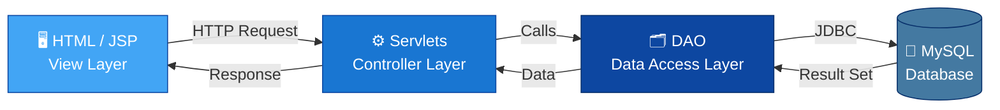

<div align="center">


<br/>

[](https://www.oracle.com/java/)
[](https://jakarta.ee/)
[](https://www.mysql.com/)
[](https://tomcat.apache.org/)
[](https://maven.apache.org/)
[](https://getbootstrap.com/)

<br/>


</div>


## 📋 Table of Contents

<table>
<tr>
<td>

- [✨ Features](#-features)
- [🧰 Tech Stack](#-tech-stack)
- [📁 Project Structure](#-project-structure)
- [✅ Prerequisites](#-prerequisites)

</td>
<td>

- [🚀 Getting Started](#-getting-started)
- [🌐 Application Routes](#-application-routes)
- [🗄️ Database Schema](#️-database-schema)
- [🏗️ Architecture](#️-architecture)

</td>
<td>

- [🖼️ Screenshots](#️-screenshots)
- [🤝 Contributing](#-contributing)
- [📄 License](#-license)
- [👤 Author](#-author)

</td>
</tr>
</table>


## ✨ Features

<div align="center">

| 🔐 | 🔑 | 🏠 | 💰 |
|:---:|:---:|:---:|:---:|
| **User Registration** | **Secure Login** | **Dashboard** | **Check Balance** |
| Auto-generated 7-digit account number | Username & password authentication | Quick access to every operation | Real-time balance lookup |

| 💵 | 💸 | 🔄 | 📜 |
|:---:|:---:|:---:|:---:|
| **Deposit Money** | **Withdraw Money** | **Send Money** | **Transaction History** |
| Add funds instantly | Withdraw from account | Transfer to another user | Full log with timestamps |

</div>


## 🧰 Tech Stack

<div align="center">


| Layer | Technology |
|:--|:--|
| 🎨 **Frontend** | HTML5, JSP, Bootstrap 5 |
| ⚙️ **Backend** | Java, Jakarta Servlets |
| 🔗 **Data Access** | JDBC, DAO Design Pattern |
| 🗄️ **Database** | MySQL 8.x |
| 📦 **Build Tool** | Maven |
| 🖥️ **Server** | Apache Tomcat 10.x (Jakarta EE) |

</div>


## 📁 Project Structure

```
BankingManagementSystem/
├── 📄 pom.xml                          # Maven build configuration
├── 🗄️ database_setup.sql               # Database & table creation script
├── 📘 README.md
└── 📂 src/main/
    ├── ☕ java/
    │   ├── Beans/               → BankUserBean, TransactionBean
    │   ├── DAO/                 → BankDAO (all DB operations)
    │   ├── DbDetails/           → DbInfo, CreateConnection
    │   └── BankServlets/        → 6 servlets (Login, Register, Deposit,
    │                              Withdraw, SendMoney, TransactionHistory)
    └── 🌐 webapp/
        ├── WEB-INF/web.xml
        ├── userLogin.html · userRegistration.html
        ├── home.jsp · balance.jsp · deposit.jsp
        ├── withdrawl.html · sendmoney.html
        └── transactionHistory.jsp · msg.jsp
```


## ✅ Prerequisites

<div align="center">

| Tool | Badge | Required Version |
|:--|:--:|:--|
| ☕ Java JDK |  | 17 or higher |
| 📦 Apache Maven |  | 3.6+ |
| 🐱 Apache Tomcat |  | 10.x *(Tomcat 9 will NOT work)* |
| 🐬 MySQL |  | 8.x |

</div>


## 🚀 Getting Started

### 1️⃣ Clone the repository
```bash
git clone https://github.com/manojkumarr12121-jpg/BankingManagementSystem.git
cd BankingManagementSystem
```

### 2️⃣ Set up the database
```sql
source database_setup.sql;
```
> Creates the `advjavamorning2` database with `bankuser` and `transactionhistory` tables.

### 3️⃣ Configure database credentials
Edit `src/main/java/DbDetails/DbInfo.java`:
```java
String uname    = "root";
String password = "your_mysql_password";
String url      = "jdbc:mysql://localhost:3306/advjavamorning2";
```

### 4️⃣ Build the project
```bash
mvn clean package
```

### 5️⃣ Deploy to Tomcat
```bash
# Windows
bin\startup.bat

# Linux/Mac
bin/startup.sh
```

### 6️⃣ Launch 🎉
```
http://localhost:8080/BankingManagementSystem/
```


## 🌐 Application Routes

<div align="center">

| Page | Route |
|:--|:--|
| 🔑 Login | `/userLogin.html` |
| 📝 Register | `/userRegistration.html` |
| 🏠 Dashboard | `/home.jsp` |
| 💰 Balance | `/balance.jsp` |
| 💵 Deposit | `/deposit.jsp` |
| 💸 Withdraw | `/withdrawl.html` |
| 🔄 Send Money | `/sendmoney.html` |
| 📜 Transaction History | `/transactionHistory.jsp` |

</div>

> 💡 **Tip:** Always start at `userLogin.html` and navigate through the app's own links — several pages depend on an active login session.


## 🗄️ Database Schema

<details>
<summary>🧾 <b>bankuser table</b> — click to expand</summary>
<br/>

| Column | Type | Description |
|:--|:--|:--|
| `uname` | VARCHAR(50) 🔑 PK | Username |
| `ufullname` | VARCHAR(100) | Full name |
| `upassword` | VARCHAR(50) | Password |
| `adhar` | BIGINT | Aadhaar number |
| `phoneno` | BIGINT | Phone number |
| `accountno` | BIGINT 🔒 UNIQUE | Auto-generated account number |
| `accountbalance` | DOUBLE | Current balance |

</details>

<details>
<summary>🧾 <b>transactionhistory table</b> — click to expand</summary>
<br/>

| Column | Type | Description |
|:--|:--|:--|
| `txnid` | BIGINT 🔑 PK, AUTO_INCREMENT | Transaction ID |
| `uname` | VARCHAR(50) 🔗 FK | Linked user |
| `txntype` | VARCHAR(20) | Deposit / Withdraw / Transfer |
| `amount` | DOUBLE | Transaction amount |
| `balanceafter` | DOUBLE | Balance after transaction |
| `description` | VARCHAR(150) | Extra details |
| `txndate` | DATETIME | Timestamp (auto-set) |

</details>


## 🏗️ Architecture

<div align="center">



</div>

A clean, layered MVC-style architecture — presentation, business logic, and data access are fully separated.


## 🖼️ Screenshots

<div align="center">

| Login Page | Registration Page |
|:--:|:--:|
| *Add screenshot here* | *Add screenshot here* |

| Dashboard | Transaction History |
|:--:|:--:|
| *Add screenshot here* | *Add screenshot here* |

</div>

> 📸 Replace the placeholders above with real screenshots — drag & drop images into the GitHub README editor and it auto-generates the image links.


## 🤝 Contributing

Contributions, issues, and feature requests are welcome!

```bash
1. Fork the project
2. Create your feature branch   → git checkout -b feature/amazing-feature
3. Commit your changes          → git commit -m "Add amazing feature"
4. Push to the branch           → git push origin feature/amazing-feature
5. Open a Pull Request
```


## 📄 License

Licensed under the **MIT License** — free to use, modify, and distribute.


## 👤 Author

<div align="center">

### Manoj Kumar

[](https://github.com/manojkumarr12121-jpg)
[](#)

⭐ **If you found this project useful, consider giving it a star!** ⭐


</div>


